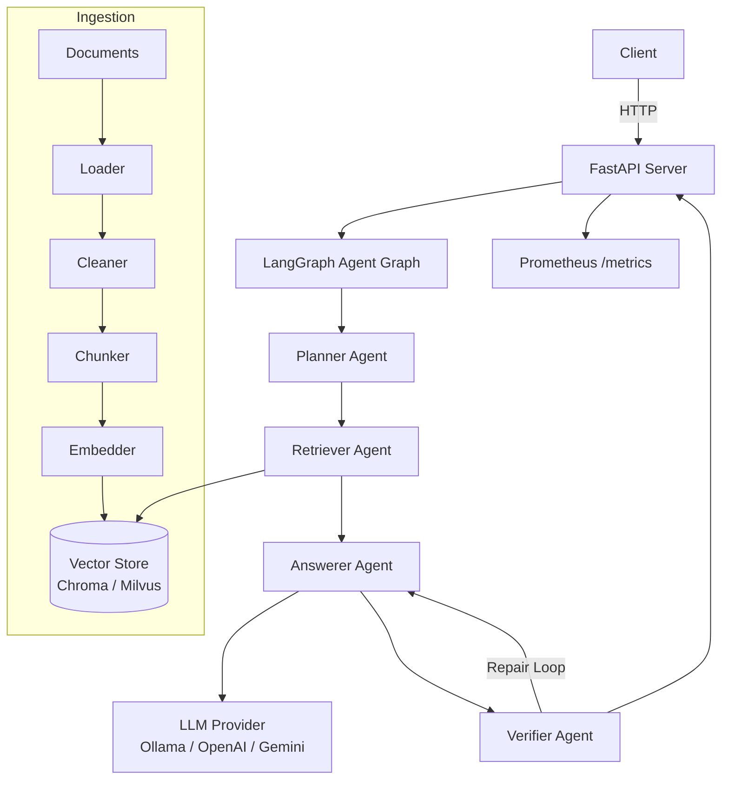

# AtlasRAG

Production-grade Enterprise Agentic RAG platform. Ask questions about company documents and get grounded, citation-backed answers.

## Features

- **Agentic RAG** — Multi-agent pipeline (Planner, Retriever, Answerer, Verifier) orchestrated with LangGraph
- **Citation-backed answers** — Every claim is traced to source documents
- **Verification loop** — Automatic fact-checking with repair when citations are missing
- **Provider flexibility** — Switch between Ollama (local/offline), OpenAI, or Gemini with one config change
- **Production-ready** — Docker Compose for local dev, Kubernetes manifests for production
- **Observability** — OpenTelemetry tracing, Prometheus metrics, Grafana dashboards
- **Quality gates** — RAGAS-based evaluation suite with CI/CD quality thresholds

## Architecture



## Quick Start

### Prerequisites

- Python 3.11+
- Docker & Docker Compose
- Ollama (`brew install ollama` or [ollama.com](https://ollama.com))

### 1. Start services

```bash
# Pull an Ollama model
ollama pull llama2

# Start the stack (API, Chroma, Postgres, Ollama)
docker compose up -d
```

### 2. Ingest sample documents

```bash
pip install -e .
python -m atlasrag.scripts.ingest_documents data/samples/
```

### 3. Query the API

```bash
curl -X POST http://localhost:8000/query \
  -H "Content-Type: application/json" \
  -d '{"query": "What is the vacation policy?"}'
```

## API Usage

### Query documents

```bash
curl -X POST http://localhost:8000/query \
  -H "Content-Type: application/json" \
  -d '{"query": "How do I report a security incident?"}'
```

### Ingest a document

```bash
curl -X POST http://localhost:8000/ingest \
  -H "Content-Type: application/json" \
  -d '{"file_path": "/data/samples/hr-handbook.txt"}'
```

### Health check

```bash
curl http://localhost:8000/health
```

### Prometheus metrics

```bash
curl http://localhost:8000/metrics
```

## Configuration

Key environment variables (see `.env.example` for all options):

| Variable | Default | Description |
|----------|---------|-------------|
| `LLM_PROVIDER` | `ollama` | LLM backend: `ollama`, `openai`, or `gemini` |
| `OLLAMA_MODEL` | `llama2` | Model name for Ollama |
| `OPENAI_API_KEY` | — | API key for OpenAI provider |
| `GEMINI_API_KEY` | — | API key for Gemini provider |
| `VECTOR_STORE` | `chroma` | Vector DB: `chroma` or `milvus` |
| `API_PORT` | `8000` | API server port |
| `LOG_LEVEL` | `INFO` | Logging level |
| `ENABLE_METRICS` | `true` | Expose Prometheus metrics |

## Development

### Install

```bash
pip install -e ".[dev]"
```

### Run tests

```bash
pytest atlasrag/tests/ -v
pytest atlasrag/tests/ --cov=atlasrag/src   # with coverage
```

### Lint and format

```bash
black atlasrag/
ruff check atlasrag/
mypy atlasrag/src/
```

### Run the API locally

```bash
python -m atlasrag.src.api.main
```

## Deployment

### Docker Compose (local / staging)

```bash
docker compose up -d                              # core services
docker compose --profile observability up -d       # with Prometheus + Grafana
```

### Kubernetes (production)

```bash
# Validate manifests
kubectl apply --dry-run=client -f infra/k8s/

# Deploy
kubectl apply -f infra/k8s/namespace.yml
kubectl apply -f infra/k8s/
```

Manifests include: Deployment (2 replicas), Service, HPA (auto-scale 2-10 pods at 70% CPU), Ingress with TLS, and Prometheus ServiceMonitor.

## Project Structure

```
atlasrag/
├── src/
│   ├── api/           # FastAPI server and routes
│   ├── agents/        # LangGraph agents (Planner, Retriever, Answerer, Verifier)
│   ├── config/        # Settings and environment loading
│   ├── ingestion/     # Document pipeline (load → clean → chunk → embed → store)
│   ├── retrieval/     # Vector store abstraction (Chroma, Milvus)
│   ├── llm/           # LLM provider abstraction (Ollama, OpenAI, Gemini)
│   ├── rag/           # RAG pipeline and prompts
│   ├── evaluation/    # RAGAS metrics and quality gates
│   └── observability/ # Logging, metrics, tracing
├── scripts/           # CLI tools (ingest, evaluate, health check)
├── eval/              # Golden evaluation dataset
└── tests/             # Unit and integration tests
infra/
├── docker/            # Dockerfile, Postgres init, Prometheus/Grafana configs
└── k8s/               # Kubernetes manifests
data/
└── samples/           # Sample documents for demo
```

## Project Status

| Phase | Description | Status |
|-------|-------------|--------|
| 0 | Prerequisites & Setup | Done |
| 1 | Project Skeleton | Done |
| 2-3 | Configuration & LLM Providers | Done |
| 4-5 | Vector Store & Document Ingestion | Done |
| 6 | Basic RAG Pipeline | Done |
| 7 | LangGraph Agent Architecture | Done |
| 8 | Verification & Repair Loop | Done |
| 9 | FastAPI Server | Done |
| 10 | Observability (Logging, Metrics, Tracing) | Done |
| 11 | Evaluation Suite (RAGAS) | Done |
| 12 | CI/CD Quality Gates | Done |
| 13 | Docker & Local Demo | Done |
| 14 | Kubernetes Manifests | Done |
| 15 | Documentation & Polish | Done |

## Tech Stack

- **API**: FastAPI, Uvicorn
- **Agents**: LangGraph
- **LLM**: Ollama, OpenAI, Google Gemini
- **Vector DB**: ChromaDB (dev), Milvus (production)
- **Database**: PostgreSQL
- **Observability**: OpenTelemetry, Prometheus, Grafana
- **Evaluation**: RAGAS
- **Infrastructure**: Docker, Kubernetes

## License

See [LICENSE](LICENSE) for details.
